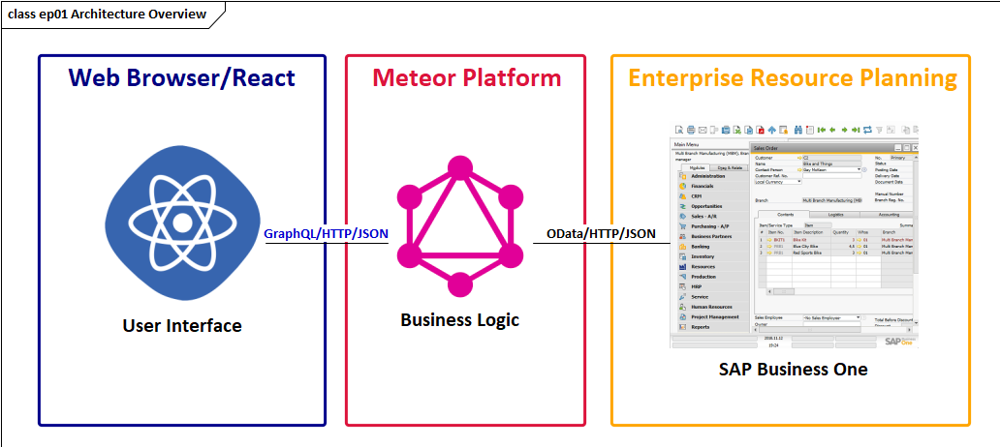
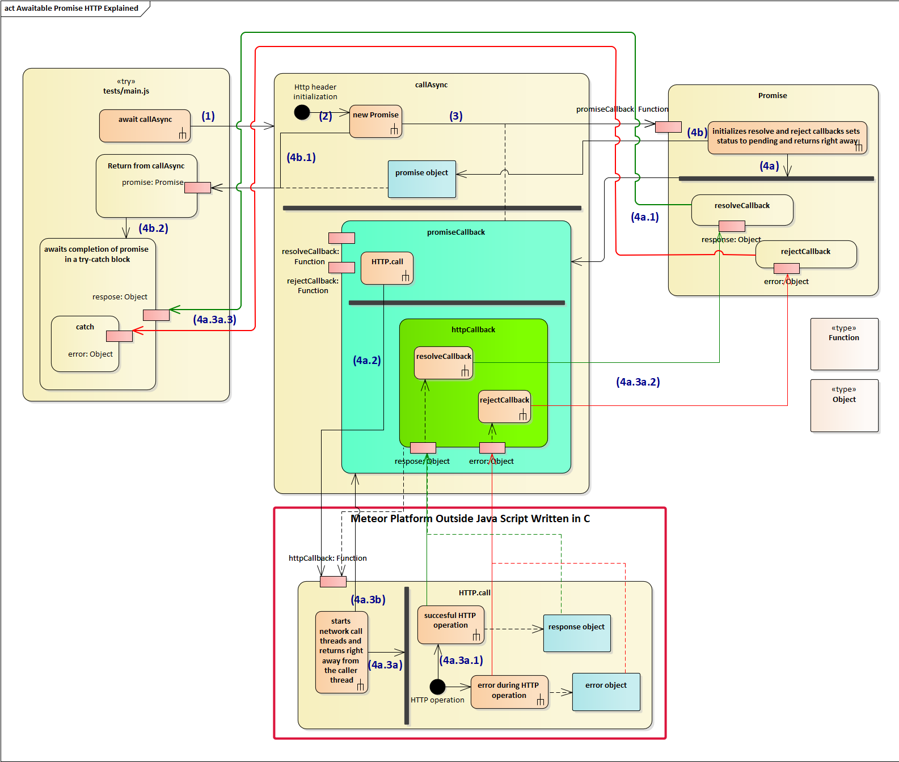
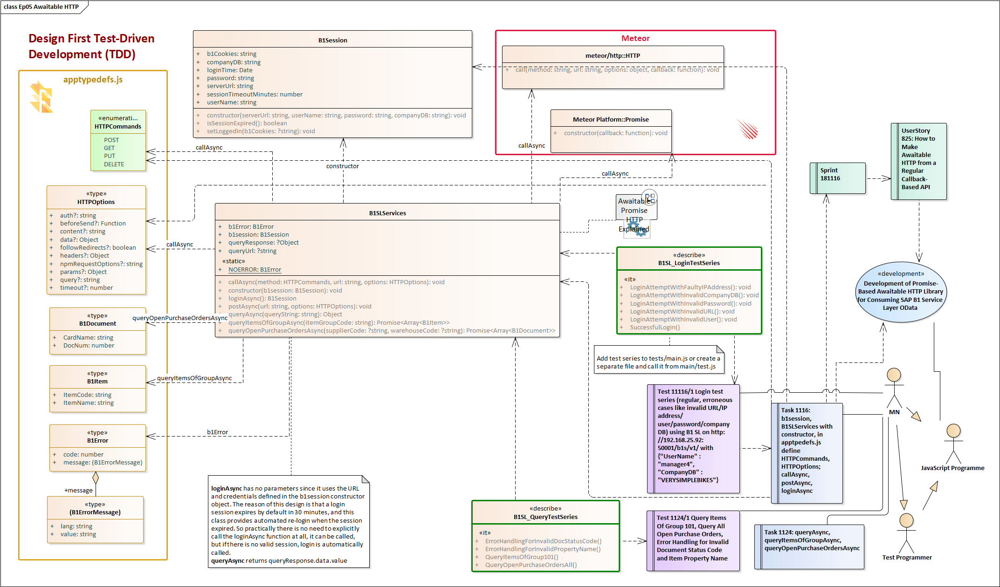

# Full-Stack Business Application Development with Meteor and SAP Business One
This is an experimental project including a video series explaining the architecture, building blocks and tools to develop a modern web browser-based, mobile-first business application. Full-stack means that it covers the user interface technology, the middle business logic layer and a mature full-fledged enterprise resource planning (ERP) system. The toolset is to develop an application from the arena of manufacturing, warehousing and logistics. 

## Application Architecture

This is an overview component diagram of the application, made with Enterprise Architect. The user interface is implemented with React, possibly the most popular UI programming package today. The UI components are styled with Materialize CSS, an implementation of Material Design. Flow is a powerful type system for Java Script, and it is used on both the client, as well as on the server side in our application. The business logic of the application is implemented with a GraphQL system, Apollo, which gives an easy to use client-side communication library, and a server side tool-set. The back-end ERP service comes from SAP Business One; it has a flashy OData API called Service Layer. 
The server is built on Meteor, the most mature Java Script web application platform. Meteor is built on top of Node JS and has cohesive integration with a number of tools and packages, including Apollo and React. Visual Studio Code is a brilliant developer tool with built-in GIT and debugging support for Java Script applications.
[ The OData services could be consumed directly from the React Java Script application running in the browser, but adding a middleware layer would give a lot more flexibility to an enterprise application. This application, nevertheless, is architected in a way to provide an easy possibility to replace the middleware with direct communication.]

## An Awaitable Promise-Based HTTP Client

## Getting Started with Business One Servive Layer Queries

### Designing Queries
The application model is extended with a general function **queryAsync** in B1SLServices. It has only one parameter, a query URL string. We have designed two application specific query functions: (1) query items of a group, and (2) a query open purchase orders. Both can have filtering parameters, and both returns an array of objects via a Promise. Two new **Flow types** have been designed for these functions: B1Item and B1Document, these are trimmed down versions of regular SAP Business One structures. When working with GraphQL we are going to implement them in full details. The return types of these functions are double composits with generics, which Flow supports brilliantly: **Promise<Array<B1Item>>** and Promise<Array<B1Document>>
A test series is designed for these new queries as part of the TDD method. It has four test cases, two positive cases and two negative; A positive case is a scenario to test a regular business workflow; a negative case is where an error condition is tested to check how the system behaves in this situation. 

### New Fields Added to B1SLServices 
The **queryUrl** contains the URL of the last executed query. This could be very useful for logging/debugging and monitoring purposes. Similarly the entire query response object can be found in **queryResponse**. In case of error **b1Error** (of type B1Error) contains B1 SL specific code and message of the error. In the catch section, it's very easy to check first the code and message via this field. 
### New Flow Type Definitions in apptypedefs
**B1Error** is the typical object format of a B1 SL error, it has a code and a message field. 
**B1Item** is an exact object type (see the special syntax curly brace followed by a pipe symbol {|).
**B1Document** is a generic data structure in B1 for a number of kinds of documents, sales/purchase orders, delivery notes, goods receipts, and so on)
### The General Query Function in B1SLServices
**queryAsync** is an async function with a mandatory queryString parameter. First it check, if there is a valid session; if not, it calls **loginAsync**. So, this design provides fully automated login and relogin service. It concatenates the query string parameter to the base URL, and saves it in the queryUrl object field. Then it invokes callAsync and saves the response into the queryResponse field.
If the HTTP status code is 200, the queryResponse.data.value is returned; this is specific to B1 SL.
In case of an error, b1Error field is set as queryResponse.data.error, and then flashy Error is thrown.
### The 1st Query Functions
**queryItemsOfGroupAsync** simply calls queryAsync with "Items?$select=ItemCode,ItemName&$filter=ItemsGroupCode eq 101" This is typical OData syntax for projection and filtering. 
**queryOpenPurchaseOrdersAsync** is similar, "PurchaseOrders?$select=DocNum,CardName&$filter=DocumentStatus eq 'bost_Open'". SAP B1 has a gigantic OData metadata document, which contains all the details. The B1 Document structure has a header part and an embedded array of Document Lines, but OData select optin gives no way to define that I want only this and that field from this embedded Document Lines structure; you can define if you want all the document lines with full details or nothing. This is where GraphQL excels. Another shocking experience with SAP B1 Sl is that it has no entry points for querying stock information out of the box. You have to create databse views and they are exposed via SL; creating schemantic layer views in SAP B1 HANA requires some effort.  
### b1querytestseries
In the header part of the **B1SL_QueryTestSeries** a new B1SLServices is created with the test B1Session parameters. Note, that there is no need to call login; it will be automatically called whenever required.
**QueryItemsOfGroup101** is an async function and the try section performs a number of validations. The catch section shows nicely how to use b1s.b1Error.message.value. QueryOpenPurchaseOrdersAll is very much alike. **ErrorHandlingForInvalidPropertyName** directly calls queryAsync intentionally with a faulty field name ItemCodeX; an error code of -1000 was expected. ErrorHandlingForInvalidDocStatusCode is very much alike, too.
### Defining Test Module in package.json
To run tests specific to this iteration the testModule option in package.json can be set to tests/b1querytestseries.js; This is a new Meteor 1.8 feature, which is nicely documented and explained in the 1.8 changelog as well as on the page https://github.com/meteor/meteor/pull/9690 .
