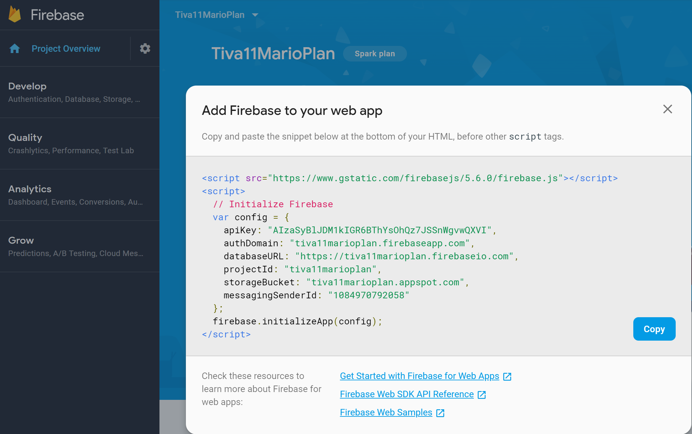

# Marioplan (Branch)
This is a remake of <a href="https://www.youtube.com/watch?v=Oi4v5uxTY5o&list=PL4cUxeGkcC9iWstfXntcj8f-dFZ4UtlN3">Net Ninja's Mariplan (React, Redux & Firebase App Tutorial)</a> with Meteor and SAP B1 SL. In his tutorial, Shaun Pelling uses Materialize CSS, that's why this is a near perfect startup project to learn from. Firesbase is interesting, too, since it is an alternative to Meteor's built-in Mongo database system for user authentication. A possible architecture of the Tiva11 service is that a user configures his/her own system defining a SAP B1 SL URL to the company database, then the employees can be configured with their own dedicated or shared SAP users. The service fee is per employee/month + transaction peanuts. For customer/user/employee registration a Firebase/Meteor database would be perfect.

## Sprint 3 - Firebase Cloud Functions, Deployment
This sprint covers videos 33 - 40. Video 33 starts talking about Firebase Functions.
For a production system configuring security rules as Ninja explained in video 32 is terribly important, but for this experimenting I didn't spent any moment on that. 
I created a new branch for this sprint: marioplan3.

<table>
<tr>
<td width="50%">
<td style="vertical-align:top">

**npm install -g firebase-tools**
 **firebase login**
 **meteor build .deploy --directory --server-only --architecture os.linux.x86_64**
When buildig Meteor for deployment you should use a target folder that is outside of the source tree, otherwise you will have a message "The output directory is under your source tree. Your generated files may get interpreted as source code! Consider building into a different directory instead meteor build ../output". Instead of using an outside directory, I used a dot-named folder, that is automatically ignored by Meteor, and I've added .deploy to **.gitignore** 
</tr>
<tr>
<td width="50%">
<td style="vertical-align:top">

**firebase deploy --only functions**
</tr>
</table>

## Sprint 1 - Setup, Getting Started with UI, React, Redux
This sprint covers videos 1 - 13. Video 14 starts talking about Redux Thunk.
I renamed the marioplan branch to marioplan1 with VS Code's excellent Git tools.
### Summary of Changes: React and Redux Packages on package.json
<table>
<tr>
<td width="50%">
<td style="vertical-align:top">
  <ul>
  <li> meteor npm install react-router-dom redux react-redux
  <li> flow-typed install --libdefDir .flow-typed
  This added a Flow type definition of react-router-dom as .flow-typed\npm\react-router-dom_v4.x.x.js
  </ul>
</tr>
<tr>
<td>
<td style="vertical-align:top">

**MarioProjectDetails** is the three-field type of a single project document.
**MarioProjectCollection** is an object with a single field an array of project documents.
**RootReducersDataTable** is an object used in the reducers.js, containing the names and data types returned by the reducers combined. The mapStateToProps functions in Dashboard.js, for example, receives the parameter state with this type to pick the data element which that form is interested in; Dashboard uses the field marioProjectCollection from this object.
**RootReducersFunctionTable** is used within reducers.js only; the names of the fields should be the same as in RootReducersDataTable. RootReducersFunctionTable has the function objects that produce the data contents for RootReducersDataTable. With these type definitions the machinery of React/Redux are cleaner and safer to maintain and extend. 
**({},string)=>{}** is a way to define a function object type in FLow.
**NavRoutesProp** is for props definitions for App and Navbar. 
</tr>
<tr>
<td>
<td style="vertical-align:top">
In Meteor the public folder is the root folder for images.
</tr>
<tr>
<td>
<td style="vertical-align:top">
I tried to install meteor add materialize:materialize, but installation resulted an error message complaining some non-existent files. I am pretty sure that this Atmosphere package has been abandoned.
I simply included the links to CDNJS: see https://materializecss.com/getting-started.html
</tr>
<tr>
<td>
<td style="vertical-align:top">
Creating the Redux store in App.jsx instead of the main.jsx gives a cleaner architecture: main.jsx is just the entry point, its job is just to link the React application to the HTML page. App has a default property NavRoutesProp that has all the route strings, and all components can use them. This is a lot more maintaineable and modular solution than just using random strings. Flow guarantees that the route paths are consistent.
</tr>
<tr>
<td>
<td style="vertical-align:top">

Never export a component as default; so always import named components with the 
syntaxt **import {CompName} from "./wherever.js"** 
I definitely not creating separate JS files for each components, only major components that are either too big to fit in a single file, or imported into multiple parent components. For example, **Dashboard** is a composit component; ProjectList and ProjectSummary are only relevant to the internal implementation of Dashboard. I don't even export these components. I never export default components. When I first created the Dashboard component its name was Dashboard, when I connected it to the Redux store, I renamed it to an unexported DashboardComponent, and the Dashbord was the object created by React-Redux connect. App.js imports explicitly the named Dashboard component, no need to mess around with the default keyword.
I significantly simplified and rationalized the reducer structures and names: mapStateToProps simply returns state.marioProjectCollection of type MarioProjectCollection.
</tr>
<tr>
<td>
<td style="vertical-align:top">
The term reducer comes from functional programming, but it is totally misleading in the context of React. Reducers actually provide data for user interface components via props. I keep the term reducer, since this is an established technical term when talking about Redux. 

The **projectReducer** returns a MarioProjectCollection whoever is interested in. Actually, Dashboard is revolving around displaying projects. In a Design 1st team, database structures and corresponding reducers are designed first. On the other hand, it's absolutely ok that first you design your UI and its interactions, data contents, workflows and design the necessare data structures for serving the requirements demanded by the UI. This second approach usually results in an absolutely fragile and unstable database structure. The database/reducer 1st approach gives all the important data element to a system and the UI guys are just create their screens for the core business logic. 
In a serverless system, the business logic is located in the client, within the browser. SAP B1 SL functions are all available directly from the browser. When you build a new application that extends SAP B1, it can be done fully in the browser. For an application like that, reducers could be a viable place to implement the business logic. The Mario Plan tutorial is totally primitive with near-zero business logic, nevertheless.
</tr>
<tr>
<td>
<td style="vertical-align:top">

I simply didn't remember the **{[e.currentTarget.id]:e.currentTarget.value}** syntax. When I have an object **const object1 = {field1:"hello",field2:12.7}** then the **object1["field1"]** is ok. Or if I have a **const field1Name = "field1"** the **object1[field1Name]** was OK, too. But this **{[field1Name]:"new value"}** syntax was new to me.
I used currentTarget of the SyntheticEvent object but it respected the id field, only when I used a full **SyntheticEvent<HTMLInputElement>**, Flow complained that id and value are undefined for type SyntheticEvent<> alone.
A gave a try to define the **onChange={this.handleChange}** for the form tag, but it didn't work taht way. 
I lazily defined an inline state type definition **{|email:string,password:string,firstName:string,lastName:string|}** but I am pretty sure later it will be replaced with a more formal definition, when the business logic is going to be in place.
</tr>
<tr>
<td>
<td style="vertical-align:top">

The **props/*:{match:{params:{id:number|string}}}*/** definition caused me a lot of research, but I found no quick and easy solution. The complexity is cause by the way React browser router works: in the App.jsx the **<Route path={navroutes.project + "/:id"} component={ProjectDetails} />** actually defines an id field, and it is passed to the ProjectDetails component via this "magic" **props.match.params.id** I absolutely hate this, but this is how React works.   
</tr>
</table>

## Sprint 2 - Beyong Getting Started: Firebase/Firestore Integration, Redux Thunk
This sprint covers videos 14 - 32. Video 14 starts talking about Redux Thunk.
I created a new branch for this sprint: marioplan2.

<table>
<tr>
<td width="50%">
<td style="vertical-align:top">
  <ul>
  <li> meteor npm install redux-thunk 
  <li> flow-typed install --libdefDir .flow-typed
  </ul>
  So, when working with the Redux Thunk middleware, an action creator that intends to perform an async operation (HTTP request, for example) should return the control immediately with a function which performs the async operation; when the async function is done it redispatches the Redux process.

  If you have the Flow error "Cannot call createStore because StoreEnhancer is incompatible with $Shape of $ObjMap in the first argument", simply **remove the redux_v4.x.x.js from the .flow_typed folder**. You'd better **delete react-redux_v5.x.x.js**, too to get rid of the Flow error message "Dispatch is not a polymorphic type". Now, you shouldn't call flow-typed install --libdefDir .flow-typed, because it would automatically reinstall redux and react-redux Flow typed files.

  Nevertheless, https://flow.org/en/docs/react/redux/ is quite a detailed document about typing Redux and Redux Thunk.
  Redux Thunk is middleware, the applyMiddleware returns an object called Redux Store Enhancer, just like reduxFirestore, reactReduxFirebase functions create store enhancer objects.
</tr>
<tr>
<td>
<td style="vertical-align:top">

**meteor npm install firebase react-redux-firebase redux-firestore**
You cannot call the generic flow-typed install, but you can install Flow typed modules one-by-one.

**flow-typed install firebase@5 --libdefDir .flow-typed**
No Flow typed libraries are available for react-redux-firebase and redux-firestore at least not on 2018/11/30.

Flow supports type spread operator, too, brilliant: https://github.com/facebook/flow/releases/tag/v0.42.0
</tr>
<tr>
<td>
<td style="vertical-align:top">

This **Unexpected identifier await getFirestore** drove me crazy for an hour or so. The reason was that I forgot to declare the Redux Thunk callback function to be async.
</tr>
<tr>
<td>
<td style="vertical-align:top">

The data field in the firestore Redux integration holds a hash-table of the objects, while ordered is an array. This was quite tricky to find: the Flow documentation section, **Objects as Maps** (https://flow.org/en/docs/types/objects/#toc-objects-as-maps) gives all the details. The syntax is in the case of a FireBase data colection is **`{[string]:{field1:string,field2:number}}`** This is called **indexer property**, too. An indexer can be optionally named in the Flow definition, for documentation purposes: **`{[id:string]:{id:string,field2:number}}`**, this syntax is especially great since it shows that the id from the internal object is used as the indexer property in the outer object; but actually this is not the case with Firebase: the id is only available as the indexer property in the **firestore.data.projects** collection object. The **firestore.ordered.projects** is an array, so the id is included in the array element objects.

The **createdAt** field is a timestamp and it cannot be simply rendered in JSX, since we have this finicky error: "Objects are not valid as a React child (found: object with keys {seconds, nanoseconds})
</tr>
<tr>
<td>
<td style="vertical-align:top">

**meteor npm install moment** See https://momentjs.com/
</table>

